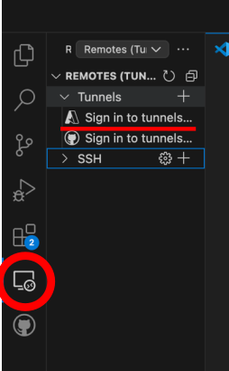

# Instructions for setting up a VS Code tunnel to access Noether

1. [Official documentation](#official-documentation)
1. [First time setup](#first-time-setup)
1. [Stopping the tunnel](#stopping-the-tunnel)
1. [Starting an already configured tunnel](#starting-an-already-configured-tunnel)
1. [Troubleshooting](#troubleshooting)
1. [Thanks](#thanks)

## Official documentation

- [Official Remote Tunnels Documentation](https://code.visualstudio.com/docs/remote/tunnels)
- [Official Troubleshooting Guide](https://code.visualstudio.com/docs/remote/troubleshooting)

## First time setup
1. Install the Microsoft `Remote - Tunnels` extension if you use the VS Code desktop application, otherwise you can skip this step.
   Open the `Extensions` sidebar (Ctrl+Shift-X), search for `ms-vscode.remote-server` and install it.
1. Connect to Noether (replace `<username>` with your own user name).
   ```
   $ ssh <username>@noether.hep.manchester.ac.uk
   ```
1. Get the VS Code Server CLI
   ```
   $ mkdir vscode
   $ cd vscode
   $ curl -L 'https://code.visualstudio.com/sha/download?build=stable&os=cli-alpine-x64' --output vscode_cli.tar.gz
   $ tar -xf vscode_cli.tar.gz
   ```
1. Start an interactive shell and move back to your home directory.
   ```
   $ condor_submit -i getenv=True
   $ cd
   ```
1. Set up the VS Code tunnel
   ```
   $ ./code tunnel
   ```
   Follow the instructions that come up (log into an account).

   1. Choose to log in with your `Microsoft account`.
   1. Open the website that is prompted and enter the code.
   1. Sign into your University Microsoft account using your University credentials.
   1. Back in the terminal, you are prompted to give the tunnel a name (eg noether).
   1. Ignore the request to open the vscode.dev url in a browser if you want to use the desktop app.

   The full terminal output looks like this:
   ```
   [<username>@<interactive node> ~]$ ./code tunnel
   *
   * Visual Studio Code Server
   *
   * By using the software, you agree to
   * the Visual Studio Code Server License Terms (https://aka.ms/vscode-server-license) and
   * the Microsoft Privacy Statement (https://privacy.microsoft.com/en-US/privacystatement).
   *
   ✔ How would you like to log in to Visual Studio Code? · Microsoft Account
   To sign in, use a web browser to open the page https://microsoft.com/devicelogin and enter the code <authcode> to authenticate.
   ✔ What would you like to call this machine? · noether
   [<date>] info Creating tunnel with the name: noether

   Open this link in your browser https://vscode.dev/tunnel/noether
   ```
1. The tunnel is set up now.
   Go to the VS Code Remote Explorer (see picture below) and select `Sign in to tunnels registered with Microsoft`.

   

   It will ask for your permission to sign into your Microsoft account and will open the sign in page in your browser.
   The tunnel should work if the sign in was successful.
   You don’t need to open a new interactive shell session in VS Code, the terminal should already be connected to it.
   If the connection is successful the following line will be shown in the terminal window.
   ```
   [<date>] info [tunnels::connections::relay_tunnel_host] Opened new client on channel 2
   ```
**IMPORTANT**
- Every time you want to use the tunnel, you need to start it again in an interactive session.
- The interactive session can only be active for a maximum of 24 hours.

## Stopping the tunnel
1. When you’re done with the tunnel, make sure you disconnect in VS Code.
   You can do this by pressing the button on the bottom left which has the name that you have given your tunnel.
   Then select `Close remote connection` in the popup.
1. Terminate the tunnel process in your interactive shell on Noether by pressing `Ctrl-C` and exit the interactive shell session.

## Starting an already configured tunnel

1. Connect to Noether (replace `<username>` with your own user name).
   ```
   $ ssh <username>@noether.hep.manchester.ac.uk
   ```
1. Start an interactive shell and move back to your home directory.
   ```
   $ condor_submit -i getenv=True
   $ cd
   ```
1. Start the VS Code tunnel
   ```
   $ ./code tunnel
   ```
   Ignore the request to open the vscode.dev url in a browser if you want to use the desktop app.
   The full terminal output looks like this:
   ```
   [<username>@<interactive node> ~]$ ./code tunnel
   *
   * Visual Studio Code Server
   *
   * By using the software, you agree to
   * the Visual Studio Code Server License Terms (https://aka.ms/vscode-server-license) and
   * the Microsoft Privacy Statement (https://privacy.microsoft.com/en-US/privacystatement).
   *

   Open this link in your browser https://vscode.dev/tunnel/noether
   ```
1. Go to the VS Code Remote Explorer.
   Select your tunnel from the list and use the buttons next to it to open a session in the current or a new window.

Make sure you [disconnect the tunnel](#stopping-the-tunnel) when you're done.

## Troubleshooting

- If you have an issue (eg after trying to open the tunnel in VS Code without having started the process on Noether), you can try the following:
  1. Sign out of your University Microsoft account in VS Code recipe:
  1. Quit VS Code.
  1. Start the tunnel on Noether.
  1. Start VS Code.
  1. Sign back into your University Microsoft account in VS Code.

## Thanks

Thanks to Oscar for providing the initial instructions.
